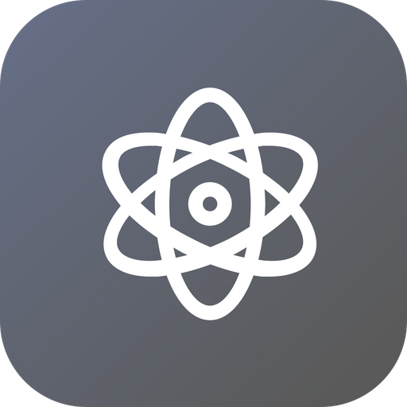
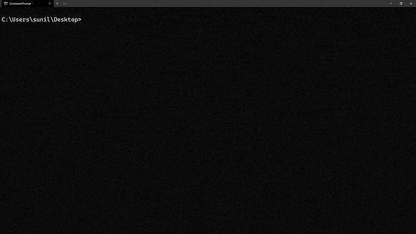

<!-- Logo -->
<p align="center">
  <a href="https://github.com/SanjaySunil/new-electron-app">
    
  </a>
</p>

<!-- Title -->
<h1 align="center">create-electron-app</h1>
  <p align="center">
    Generate a new Electron App within a minute!
    <br />
    <br />
    <a href="">Report Bug</a>
    ·
    <a href="">Request Feature</a>
    ·
    <a href="">Support</a>
  </p>
</h1>
<br/><br/>

<!-- Preview -->
<p align="center">
  <a href="">
    
  </a>
  <!-- Drop Shadow -->
  <a href="">
    
  </a>
</p>
<br/>

<!-- Information -->

## What's create-electron-app?

<a href="" target="_blank">Create-Electron-App</a> is a simple, minimal CLI app that can generate an Electron App within a minute! Create-Electron-App uses <a href="https://github.com/sanjaysunil/Electron-Boilerplate">Electron-Boilerplate</a> as the boilerplate. 
<br/>

<!-- Features -->

## ✨ Features

- ⚡ **Fast Installation:** Simply run `npx new-electron-app`! 
- 🔨 **Electron-Builder:** Electron Builder implementation ready for cross-platform builds.
- ✨ **Customisation:** Easy to customise and built-in features.
  <br/>

<!-- Getting Started -->

## 🛠 Getting Started

<br/>

<!-- Prerequisites -->

### **Step 1:** Prerequisites

- NPM

```sh
npm install npm@latest -g
```

- new-electron-app
```sh
npm install new-electron-app -g
```

<br/>

<!-- Installation -->

### **Step 2:** Installation

1. Open your preferred terminal.

<!--
> ⚠️ **NOTE**: Write a quick warning here if necessary.
-->

2. Run new-electron-app anywhere!
```sh
npx new-electron-app
```

or 
```sh 
npm run new-electron-app
```

<br/>

<!-- ROADMAP -->

## Roadmap

See the [open issues](https://github.com/SanjaySunil/create-electron-app/issues) for a list of proposed features (and known issues).
<br/>

<!-- CONTRIBUTING -->

## Contributing

Contributions are what make the open source community such an amazing place to be learn, inspire, and create. Any contributions you make are **greatly appreciated**.

View [contribution guide]().
<br/>

<!--
## Supporters/Contributors

Show supporters of your project
View RepoRoster for more information
https://reporoster.com/

[](https://github.com/D3VSJ/README/stargazers)
[](https://github.com/D3VSJ/README/network/members)
<br/>
-->

## License

Copyright © 2021 Sanjay Sunil (sanjaysunil@protonmail.com)

Distributed under the MIT License. See `LICENSE` for more information.
